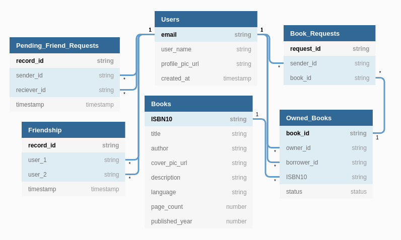
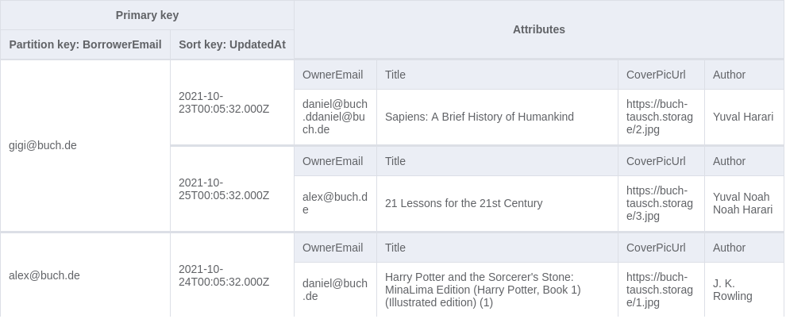

# buch-tausch-24

## Desired Features

As a registered user, I can...

1. `Auth` sign in and logout
2. `Search` find any book(s) by ISBN / title
3. `Search` find other users
4. `C` add book(s) that I own to my booklist
5. `C` send friends requests
   send request to a friend to borrow a specific book
6. `U/D` accept / deny a friend request (U/D)
7. `U/D` accept / deny borrow request from a friend
8. `U` mark book as borrowed / returned
9. `R` list all books of a user and the status of the books
10. `R` list all books that a user has borrowed
11. `R` view details of a book and list of owners
12. `R` lists all pending friend requests
13. `R` list all confirmed friends

## Comparison of Data Structure in different DB

### SQL

### DynamoDB

### Main Table

### Secondary Index

1. InvertedIndex - For querying the book request senders of a specific book:

2. GSI-1 - For querying all books that a user has borrowed:

3. GSI-2 - For querying all owners of a specific book:

